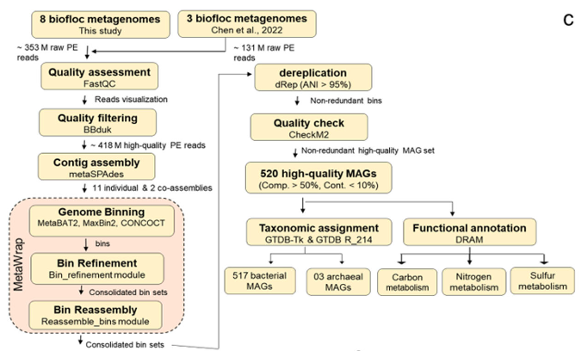

# Biofloc Metagenomics Analysis 
Name: Lihong Yang

**Link to reference paper**: [Rajeev et al. (2024) - Genome-centric metagenomics provides insights into the core microbial community and functional profiles of biofloc aquaculture](https://journals.asm.org/doi/10.1128/msystems.00782-24)

---

## Project Overview 

Quality assessment and visualization of 398 metagenome-assembled genomes (MAGs) from biofloc aquaculture systems. The pipeline of this paper is given as the below figure. 



In this report, I include the steps until the relative abundance profiling and a table. The final objective for this project is to visualize the MAG quality with R plot. 

---

## Repository Structure

```
biofloc-mag-quality/
├── README.md                               # This file
├── test_dataset/
│   └── SRRxxxx (one set of raw data if anyone want to reproduce)  
├── linux_scripts/
│   ├── 01_download_sra.sh
│   ├── 02_convert_to_fastq.sh
│   ├── 03_fastqc_rawdata
│   ├── 04_bbduk_trim.sh
│   ├── 05_metaspades_individual.sh
│   ├── 06_metaspades_coassembly.sh
│   ├── 07_metawrap_binning.sh
│   ├── 07_uncompress_for_binning.sh
│   ├── 08_metawrap_bin_refinement.sh
│   ├── 09_collect_all_bins.sh
│   ├── 10_checkm_binsABC.sh
│   ├── 11_drep_dereplicate.sh
│   ├── 13_checkm2_quality.sh
│   └── 15_MAG_quality_visualization.R 
├── figures/
│   ├── fig1_mag_quality_scatter.png        # Completeness vs contamination
│   ├── fig2_quality_tier_barplot.png       # Quality distribution
│   └── fig3_completeness_histogram.png     # Completeness distribution
└── results/
    ├── quality_statistics.csv              # Summary statistics
    └── all_mag_quality.csv                 # Full quality table
```

---

## Quick Results Summary

- **398 dereplicated MAGs** from 10 biofloc samples
- **193 high-quality** (48.5%): ≥90% completeness, <5% contamination
- **205 medium-quality** (51.5%): ≥50% completeness, <10% contamination
- **100% meet MIMAG standards**

---

## Important Notes! Please read before continuing.

### Dataset Information
*This analysis uses **398 dereplicated MAGs** from 10 biofloc samples. All MAGs have been quality-filtered (≥50% completeness, <10% contamination) and dereplicated at 95% ANI threshold using dRep.*

### Changing file paths in scripts
*All bash scripts contain file paths that need to be changed to match your directory structure. Make sure to update the SLURM parameters (allocation name, email) and file paths in each script before running. All scripts contain comments indicating where to update paths.*

### Computational requirements
*This pipeline requires access to a high-performance computing cluster. The complete pipeline takes approximately **150-200 hours** of compute time.*

---

## Software Requirements and Environment Setup

### Prerequisites: Load ARC Modules

Before creating any conda environments, load the required modules on Virginia Tech ARC:

```bash
# Load Miniconda
module load Miniconda3/23.1.0-1

# Verify conda installation
conda --version
# Should output: conda 23.1.0

# Load other required modules (for Steps 1-4)
module load sratoolkit/3.0.0
module load FastQC/0.11.9
module load BBMap/38.90
module load SPAdes/3.15.5
```

---

## Detailed Conda Environment Setup

### Environment 1: MetaWRAP (for Binning, Refinement, and CheckM)

**Purpose**: This environment is used for Steps 8, 9, and 11 (binning, bin refinement, and quality assessment)

**Step 1a: Create base environment**
```bash
# Create environment with Python 3.6 (required for MetaWRAP compatibility)
conda create -n metawrap_env python=3.6 -y

# Activate the environment
conda activate metawrap_env

# Verify Python version
python --version
# Should output: Python 3.6.x
```

**Step 1b: Configure conda channels**
```bash
# Add required channels in correct priority order
conda config --add channels defaults
conda config --add channels conda-forge
conda config --add channels bioconda
conda config --add channels ursky

# Verify channel priority
conda config --show channels
# Should show: ursky > bioconda > conda-forge > defaults
```

**Step 1c: Install MetaWRAP and core dependencies**
```bash
# Install MetaWRAP (includes MetaBAT2, MaxBin2, CONCOCT)
conda install -c ursky metawrap-mg=1.3.2 -y

# Install additional binning tools
conda install -c bioconda metabat2=2.15 -y
conda install -c bioconda maxbin2=2.2.7 -y
conda install -c bioconda concoct=1.1.0 -y

# Install quality assessment tool
conda install -c bioconda checkm-genome=1.2.0 -y

# Install mapping and processing tools
conda install -c bioconda bowtie2=2.4.4 -y
conda install -c bioconda samtools=1.15 -y
conda install -c bioconda bwa=0.7.17 -y

# Install analysis tools
conda install -c bioconda prodigal=2.6.3 -y
conda install -c bioconda hmmer=3.3.2 -y
conda install -c bioconda pplacer=1.1.alpha19 -y
```

**Step 1d: Configure CheckM database**
```bash
# Download CheckM database (one-time setup, ~275 MB)
mkdir -p /projects/nikhita/lihong/databases/checkm_data
cd /projects/nikhita/lihong/databases/checkm_data

# Download and extract database
wget https://data.ace.uq.edu.au/public/CheckM_databases/checkm_data_2015_01_16.tar.gz
tar -xvzf checkm_data_2015_01_16.tar.gz

# Configure CheckM to use this database
checkm data setRoot /projects/nikhita/lihong/databases/checkm_data

# Verify configuration
cat ~/.checkm/DATA_CONFIG
# Should show:
# [checkm]
# dataRoot = /projects/nikhita/lihong/databases/checkm_data

# Test CheckM installation
checkm test ~/checkm_test_results
# Should complete without errors
```

**Step 1e: Verify MetaWRAP installation**
```bash
# Check all binning tools are accessible
which metawrap
which metabat2
which maxbin2
which run_concoct.py
which checkm

# Test MetaWRAP
metawrap -h
# Should display MetaWRAP help message

# List available MetaWRAP modules
metawrap --show-config
```

---

### Environment 2: dRep (for Dereplication)

**Purpose**: This environment is used for Step 12 (MAG dereplication based on ANI)

**Step 2a: Create base environment**
```bash
# Deactivate previous environment
conda deactivate

# Create environment with Python 3.8
conda create -n drep_env python=3.8 -y

# Activate environment
conda activate drep_env

# Verify Python version
python --version
# Should output: Python 3.8.x
```

**Step 2b: Install dRep and dependencies**
```bash
# Add required channels
conda config --add channels defaults
conda config --add channels conda-forge
conda config --add channels bioconda

# Install dRep
conda install -c bioconda drep=3.4.0 -y

# Install ANI calculation tools
conda install -c bioconda mash=2.3 -y          # Fast ANI estimation
conda install -c bioconda fastani=1.33 -y      # Accurate ANI calculation

# Install additional dependencies
conda install -c bioconda prodigal=2.6.3 -y    # Gene prediction
conda install -c bioconda checkm-genome=1.2.0 -y  # Quality assessment
conda install -c conda-forge numpy=1.21.0 -y   # Numerical computing
conda install -c conda-forge pandas=1.3.0 -y   # Data manipulation
conda install -c conda-forge matplotlib=3.4.2 -y  # Plotting
conda install -c conda-forge seaborn=0.11.1 -y # Advanced plotting
```

**Step 2c: Verify dRep installation**
```bash
# Check tool availability
which dRep
which mash
which fastANI

# Test dRep
dRep -h
# Should display dRep help message

# Test ANI tools
mash --version
# Should output: Mash version 2.3
fastANI --version
# Should output: version 1.33

# Verify dRep modules
dRep bonus --help
# Should list available bonus modules
```

---

### Environment 3: GTDB-Tk (optional, for Taxonomic Classification)

**Purpose**: This environment is used for Step 14 (taxonomic classification of MAGs)

**Step 3a: Create base environment**
```bash
# Deactivate previous environment
conda deactivate

# Create environment with Python 3.8
conda create -n gtdbtk_env python=3.8 -y

# Activate environment
conda activate gtdbtk_env
```

**Step 3b: Install GTDB-Tk**
```bash
# Add required channels
conda config --add channels defaults
conda config --add channels conda-forge
conda config --add channels bioconda

# Install GTDB-Tk
conda install -c bioconda gtdbtk=2.3.0 -y

# Install dependencies
conda install -c bioconda prodigal=2.6.3 -y
conda install -c bioconda hmmer=3.3.2 -y
conda install -c bioconda pplacer=1.1.alpha19 -y
conda install -c bioconda fastani=1.33 -y
conda install -c bioconda fasttree=2.1.11 -y
conda install -c bioconda mash=2.3 -y
```

**Step 3c: Download GTDB database**
```bash
# Create database directory
mkdir -p /projects/nikhita/lihong/databases/gtdbtk_data
cd /projects/nikhita/lihong/databases/gtdbtk_data

# Download GTDB-Tk reference data (Release 207, ~65 GB)
wget https://data.gtdb.ecogenomic.org/releases/release207/207.0/auxillary_files/gtdbtk_r207_v2_data.tar.gz

# Extract database
tar -xvzf gtdbtk_r207_v2_data.tar.gz

# Set GTDB-Tk database path
export GTDBTK_DATA_PATH=/projects/nikhita/lihong/databases/gtdbtk_data/release207_v2

# Add to bashrc for permanent setup
echo 'export GTDBTK_DATA_PATH=/projects/nikhita/lihong/databases/gtdbtk_data/release207_v2' >> ~/.bashrc
```

**Step 3d: Verify GTDB-Tk installation**
```bash
# Test GTDB-Tk
gtdbtk --version
# Should output: gtdbtk: version 2.3.0

# Verify database installation
gtdbtk check_install
# Should output: [SUCCESS] All reference files found

# Test GTDB-Tk with example
gtdbtk test --out_dir ~/gtdbtk_test
# Should complete successfully
```

---

### Environment 4: R (for Visualization)

**Purpose**: This environment is used for Step 15 (creating quality assessment plots)

**Option A: Using system R with package installation**
```r
# Launch R
R

# Install tidyverse package
install.packages("tidyverse")

# Load and verify
library(tidyverse)
packageVersion("tidyverse")
# Should show version >= 2.0.0

# Install individual packages if tidyverse installation fails
install.packages(c("ggplot2", "dplyr", "readr", "tidyr", "tibble", "stringr"))
```

**Option B: Using conda R environment**
```bash
# Create R environment
conda create -n r_env -y
conda activate r_env

# Install R and packages
conda install -c conda-forge r-base=4.3.1 -y
conda install -c conda-forge r-tidyverse=2.0.0 -y
conda install -c conda-forge r-ggplot2=3.4.2 -y
conda install -c conda-forge r-dplyr=1.1.2 -y
conda install -c conda-forge r-readr=2.1.4 -y

# Verify R installation
R --version
# Should show R version 4.3.1

# Test packages
R -e "library(tidyverse)"
# Should load without errors
```

---

## Summary of Conda Environments

| Environment | Python | Key Packages | Used in Steps |
|-------------|--------|--------------|---------------|
| metawrap_env | 3.6 | MetaWRAP, CheckM, MetaBAT2, MaxBin2, CONCOCT | 8, 9, 11 |
| drep_env | 3.8 | dRep, MASH, FastANI | 12 |
| gtdbtk_env | 3.8 | GTDB-Tk, pplacer, FastANI | 14 (optional) |
| r_env | - | R, tidyverse, ggplot2 | 15 |

---

## Quick Reference: Activating Environments

```bash
# For binning and refinement (Steps 8, 9, 11)
conda activate metawrap_env

# For dereplication (Step 12)
conda activate drep_env

# For taxonomy (Step 14, optional)
conda activate gtdbtk_env

# For visualization (Step 15)
conda activate r_env  # or use system R

# To deactivate current environment
conda deactivate

# To list all environments
conda env list
```

---

## Step 0: Initial Setup

**Clone repository and create directory structure:**
```bash
cd /your/working/directory
git clone https://github.com/LihongYang99/bft_2025_msystems
cd bft_2025_msystems

# Create all necessary directories
mkdir -p 01_raw_data 02_trimmed_data 03_fastqc_results 04_assemblies
mkdir -p 05_binning 06_bin_refinement 07_all_bins 08_checkm_results
mkdir -p 09_drep_results 10_gtdbtk_results figures results
```

---

## Step-by-Step Pipeline

### Step 1: Download SRA Files

**Purpose**: Download raw sequencing data from NCBI SRA database

**Load required modules:**
```bash
module load sratoolkit/3.0.0
```

**Run download:**
```bash
cd linux_scripts
sbatch 01_download_sra.sh
```

**Time**: ~26 hours  
**Output**: `01_raw_data/*.sra` (10 SRA files: SRR24442552 - SRR24442561)

---

### Step 2: Convert SRA to FASTQ

**Purpose**: Convert SRA format to FASTQ for downstream analysis

**Load required modules:**
```bash
module load sratoolkit/3.0.0
```

**Run conversion:**
```bash
sbatch 02_convert_to_fastq.sh
```

**Time**: ~8-12 hours  
**Output**: `01_raw_data/*.fastq` (20 files: R1 + R2 for 10 samples)

---

### Step 3: Quality Check (Raw Data)

**Purpose**: Generate quality reports for raw sequencing data

**Load required modules:**
```bash
module load FastQC/0.11.9
```

**Run quality check:**
```bash
sbatch 03_fastqc_rawdata.sh
```

**Time**: ~2-4 hours  
**Output**: `03_fastqc_results/*_fastqc.html`

---

### Step 4: Quality Trimming

**Purpose**: Remove adapters and low-quality bases using BBDuk

**Load required modules:**
```bash
module load BBMap/38.90
```

**Run trimming:**
```bash
sbatch 04_bbduk_trim.sh
```

**Parameters**:
- Quality threshold: Q20
- Minimum length: 60 bp
- Adapter file: adapters.fa

**Time**: ~6-8 hours  
**Output**: `02_trimmed_data/*_trimmed_R1.fastq` and `*_trimmed_R2.fastq`

---

### Step 5: Individual Sample Assembly

**Purpose**: Assemble each sample separately with metaSPAdes

**Load required modules:**
```bash
module load SPAdes/3.15.5
```

**Run assembly:**
```bash
sbatch 05_metaspades_individual.sh
```

**Time**: ~40-60 hours  
**Output**: `04_assemblies/individual/SRR*/contigs.fasta` (10 assemblies)

---

### Step 6: Co-assembly

**Purpose**: Assemble all samples together to improve MAG recovery

**Load required modules:**
```bash
module load SPAdes/3.15.5
```

**Run co-assembly:**
```bash
sbatch 06_metaspades_coassembly.sh
```

**Time**: ~60-80 hours  
**Output**: `04_assemblies/coassembly/contigs.fasta`

**Note**: Co-assembly combines reads from all 10 samples to improve coverage and assembly of shared taxa

---

### Step 7: Prepare for Binning

**Purpose**: Uncompress assembly files if needed

```bash
sbatch 07_uncompress_for_binning.sh
```

**Time**: ~30 minutes  
**Output**: Uncompressed FASTA files

---

### Step 8: Binning

**Purpose**: Bin contigs into draft MAGs using three algorithms

**Activate environment:**
```bash
conda activate metawrap_env
```

**Run binning:**
```bash
sbatch 07_metawrap_binning.sh
```

**Algorithms used**:
- MetaBAT2 (coverage-based binning)
- MaxBin2 (marker gene + coverage)
- CONCOCT (sequence composition + coverage)

**Time**: ~24-36 hours  
**Output**: 
- `05_binning/metabat2_bins/*.fa`
- `05_binning/maxbin2_bins/*.fa`
- `05_binning/concoct_bins/*.fa`

---

### Step 9: Bin Refinement

**Purpose**: Consolidate bins from three algorithms and improve quality

**Activate environment:**
```bash
conda activate metawrap_env
```

**Run refinement:**
```bash
sbatch 08_metawrap_bin_refinement.sh
```

**Quality thresholds**:
- Minimum completeness: 50%
- Maximum contamination: 10%

**What happens**:
- Compares bins from all three algorithms
- Creates consensus/hybrid bins
- Selects best quality bins
- Removes redundancy between algorithms

**Time**: ~12-20 hours  
**Output**: `06_bin_refinement/metawrap_50_10_bins/*.fa` (refined bins)

---

### Step 10: Collect All Bins

**Purpose**: Gather all refined bins into one directory

```bash
sbatch 09_collect_all_bins.sh
```

**Time**: ~5 minutes  
**Output**: `07_all_bins/*.fa` (832 bins total from all samples)

---

### Step 11: Quality Assessment with CheckM

**Purpose**: Evaluate completeness and contamination using single-copy marker genes

**Activate environment:**
```bash
conda activate metawrap_env
```

**Run CheckM:**
```bash
sbatch 10_checkm_binsABC.sh
```

**What CheckM does**:
- Identifies 120 bacterial single-copy marker genes
- Calculates completeness (% markers present)
- Calculates contamination (% markers duplicated)
- Estimates strain heterogeneity

**Time**: ~16-24 hours  
**Output**: `08_checkm_results/checkm_summary.tsv`

**Important columns**:
- Column 1: Bin Id
- Column 6: Completeness (%)
- Column 7: Contamination (%)
- Column 8: Strain heterogeneity

---

### Step 12: Dereplication with dRep

**Purpose**: Remove redundant MAGs (≥95% ANI = same species)

**Activate environment:**
```bash
conda activate drep_env
```

**Run dRep:**
```bash
sbatch 11_drep_dereplicate.sh
```

**Parameters**:
- Primary clustering: 90% ANI (MASH - fast)
- Secondary clustering: 95% ANI (FastANI - accurate)
- Quality score: Completeness - 5×Contamination
- Min completeness: 50%
- Max contamination: 10%

**What dRep does**:
1. Primary clustering with MASH (fast, approximate ANI)
2. Secondary clustering with FastANI (accurate ANI)
3. Groups MAGs with ≥95% ANI (same species)
4. Selects best representative per cluster based on quality score
5. Outputs dereplicated set of MAGs

**Time**: ~8-12 hours  
**Output**: 
- `09_drep_results/dereplicated_genomes/*.fa` (398 MAGs)
- `09_drep_results/data_tables/Widb.csv` (quality metrics for visualization)
- `09_drep_results/data_tables/Cdb.csv` (clustering information)
- `09_drep_results/figures/` (clustering dendrograms)

---

### Step 13: Consolidate CheckM Results (Optional)

**Purpose**: Merge CheckM outputs from multiple runs

```bash
sbatch 13_consolidate_checkm_results.sh
```

**Time**: ~5 minutes  
**Output**: Consolidated quality summary table

---

### Step 14: Taxonomic Classification (Optional)

**Purpose**: Assign taxonomy to MAGs using GTDB database

**Activate environment:**
```bash
conda activate gtdbtk_env
```

**Download database (one-time):**
```bash
sbatch 14a_download_gtdbtk_db.sh
```

**Time**: ~2-4 hours

**Run classification:**
```bash
sbatch 14b_gtdbtk_classify.sh
```

**What GTDB-Tk does**:
1. Identifies genes in MAGs
2. Aligns to GTDB reference proteins
3. Places MAGs in reference phylogeny
4. Assigns taxonomy (domain to species)

**Time**: ~20-30 hours  
**Output**: `10_gtdbtk_results/gtdbtk.bac120.summary.tsv`

---

### Step 15: Visualization in R

**Purpose**: Generate quality assessment plots

**Install R package:**
```r
install.packages("tidyverse")
```

**Run visualization:**

**Option A - RStudio:**
```r
# Set working directory
setwd("/path/to/bft_2025_msystems")

# Load package
library(tidyverse)

# Run script
source("linux_scripts/15_MAG_quality_visualization.R")
```

**Option B - Command line:**
```bash
cd /path/to/bft_2025_msystems
Rscript linux_scripts/15_MAG_quality_visualization.R
```

**Time**: ~1-2 minutes  
**Output**:
- `figures/fig1_mag_quality_scatter.png` - Completeness vs contamination scatter plot
- `figures/fig2_quality_tier_barplot.png` - Quality tier distribution bar chart
- `figures/fig3_completeness_histogram.png` - Completeness distribution histogram
- `results/quality_statistics.csv` - Summary statistics table
- `results/all_mag_quality.csv` - Full quality data with tier classifications

---

## Final Results

### MAG Statistics

| Metric | Value |
|--------|-------|
| Starting bins (after refinement) | 832 |
| Dereplicated MAGs | 398 |
| High-quality (≥90% comp, <5% cont) | 193 (48.5%) |
| Medium-quality (≥50% comp, <10% cont) | 205 (51.5%) |
| Low-quality | 0 (0.0%) |
| Mean completeness | 84.41% |
| Mean contamination | 1.65% |
| Quality standards met | 100% |

### MIMAG Quality Standards

| Quality Tier | Completeness | Contamination | Applications |
|--------------|--------------|---------------|--------------|
| High-quality | ≥90% | <5% | Detailed functional annotation, comparative genomics |
| Medium-quality | ≥50% | <10% | Community analysis, metabolic pathway detection |
| Low-quality | <50% or ≥10% | Any | Limited use, requires refinement |

---

## Key Files

### Input Data
- **SRA IDs**: SRR24442552 - SRR24442561 (10 samples)
- **BioProject**: PRJNA832651
- **Source**: Biofloc aquaculture system (shrimp)

### Main Output Files
- `09_drep_results/dereplicated_genomes/*.fa` - 398 dereplicated MAG FASTA files
- `09_drep_results/data_tables/Widb.csv` - Quality metrics used for R visualization
- `figures/*.png` - Three quality assessment plots
- `results/quality_statistics.csv` - Summary statistics

---

## Appendix: Software Versions

| Software | Version | Purpose |
|----------|---------|---------|
| SRA Toolkit | 3.0.0 | Data download and conversion |
| FastQC | 0.11.9 | Quality control |
| BBDuk (BBMap) | 38.90 | Adapter trimming and quality filtering |
| metaSPAdes | 3.15.5 | Metagenome assembly |
| MetaWRAP | 1.3.2 | Binning pipeline wrapper |
| MetaBAT2 | 2.15 | Coverage-based binning |
| MaxBin2 | 2.2.7 | Marker gene-based binning |
| CONCOCT | 1.1.0 | Composition-based binning |
| CheckM | 1.2.0 | Quality assessment |
| dRep | 3.4.0 | Genome dereplication |
| MASH | 2.3 | Fast ANI estimation |
| FastANI | 1.33 | Accurate ANI calculation |
| GTDB-Tk | 2.3.0 | Taxonomic classification |
| R | ≥4.0.0 | Statistical computing and visualization |
| tidyverse | ≥2.0.0 | R data science packages |

---


